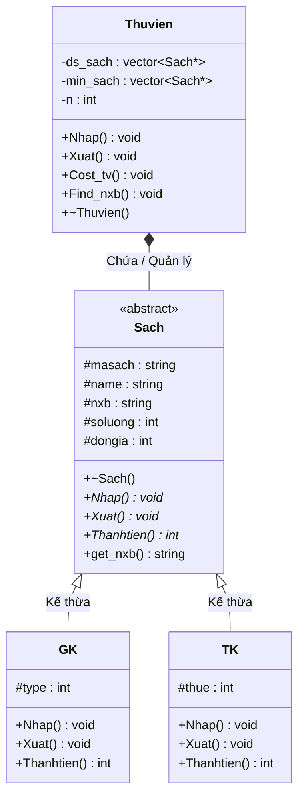

```mermaid
classDiagram
    class Sach {
        <<abstract>>
        #masach : string
        #name : string
        #nxb : string
        #soluong : int
        #dongia : int
        +~Sach()
        +Nhap() void*
        +Xuat() void*
        +Thanhtien() int*
        +get_nxb() string
    }

    class GK {
        #type : int
        +Nhap() void
        +Xuat() void
        +Thanhtien() int
    }

    class TK {
        #thue : int
        +Nhap() void
        +Xuat() void
        +Thanhtien() int
    }

    class Thuvien {
        -ds_sach : vector~Sach*~
        -min_sach : vector~Sach*~
        -n : int
        +Nhap() void
        +Xuat() void
        +Cost_tv() void
        +Find_nxb() void
        +~Thuvien()
    }

    %% Quan hệ kế thừa
    Sach <|-- GK : Kế thừa
    Sach <|-- TK : Kế thừa

    %% Quan hệ thành phần (Sở hữu)
    Thuvien *-- Sach : Chứa / Quản lý

```
