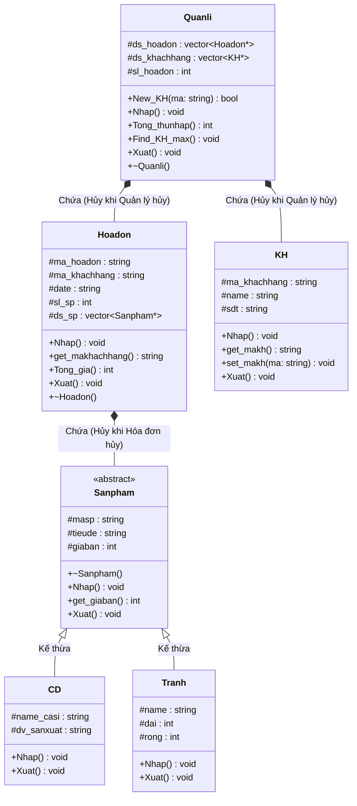

```mermaid
classDiagram
    class Sanpham {
        <<abstract>>
        #masp : string
        #tieude : string
        #giaban : int
        +~Sanpham()
        +Nhap() void
        +get_giaban() int
        +Xuat() void
    }

    class CD {
        #name_casi : string
        #dv_sanxuat : string
        +Nhap() void
        +Xuat() void
    }

    class Tranh {
        #name : string
        #dai : int
        #rong : int
        +Nhap() void
        +Xuat() void
    }

    class Hoadon {
        #ma_hoadon : string
        #ma_khachhang : string
        #date : string
        #sl_sp : int
        #ds_sp : vector~Sanpham*~
        +Nhap() void
        +get_makhachhang() string
        +Tong_gia() int
        +Xuat() void
        +~Hoadon()
    }

    class KH {
        #ma_khachhang : string
        #name : string
        #sdt : string
        +Nhap() void
        +get_makh() string
        +set_makh(ma: string) void
        +Xuat() void
    }

    class Quanli {
        #ds_hoadon : vector~Hoadon*~
        #ds_khachhang : vector~KH*~
        #sl_hoadon : int
        +New_KH(ma: string) bool
        +Nhap() void
        +Tong_thunhap() int
        +Find_KH_max() void
        +Xuat() void
        +~Quanli()
    }

    %% Quan hệ kế thừa (Inheritance)
    Sanpham <|-- CD : Kế thừa
    Sanpham <|-- Tranh : Kế thừa

    %% Quan hệ thành phần (Composition - Quản lý vòng đời bộ nhớ)
    Hoadon *-- Sanpham : Chứa (Hủy khi Hóa đơn hủy)
    Quanli *-- Hoadon : Chứa (Hủy khi Quản lý hủy)
    Quanli *-- KH : Chứa (Hủy khi Quản lý hủy)

```
