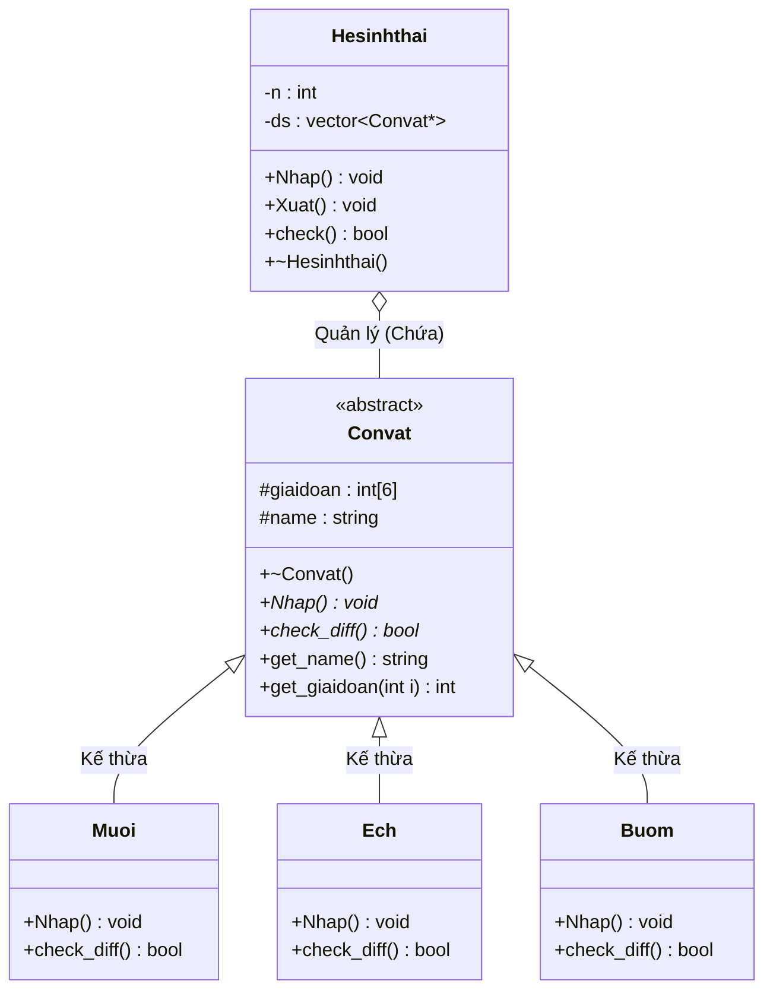

```mermaid
classDiagram
    class Convat {
        <<abstract>>
        #giaidoan : int[6]
        #name : string
        +~Convat()
        +Nhap() void*
        +check_diff() bool*
        +get_name() string
        +get_giaidoan(int i) int
    }

    class Muoi {
        +Nhap() void
        +check_diff() bool
    }

    class Ech {
        +Nhap() void
        +check_diff() bool
    }

    class Buom {
        +Nhap() void
        +check_diff() bool
    }

    class Hesinhthai {
        -n : int
        -ds : vector~Convat*~
        +Nhap() void
        +Xuat() void
        +check() bool
        +~Hesinhthai()
    }

    %% Mối quan hệ kế thừa (Inheritance)
    Convat <|-- Muoi : Kế thừa
    Convat <|-- Ech : Kế thừa
    Convat <|-- Buom : Kế thừa

    %% Mối quan hệ tập hợp (Aggregation)
    Hesinhthai o-- Convat : Quản lý (Chứa)
```
