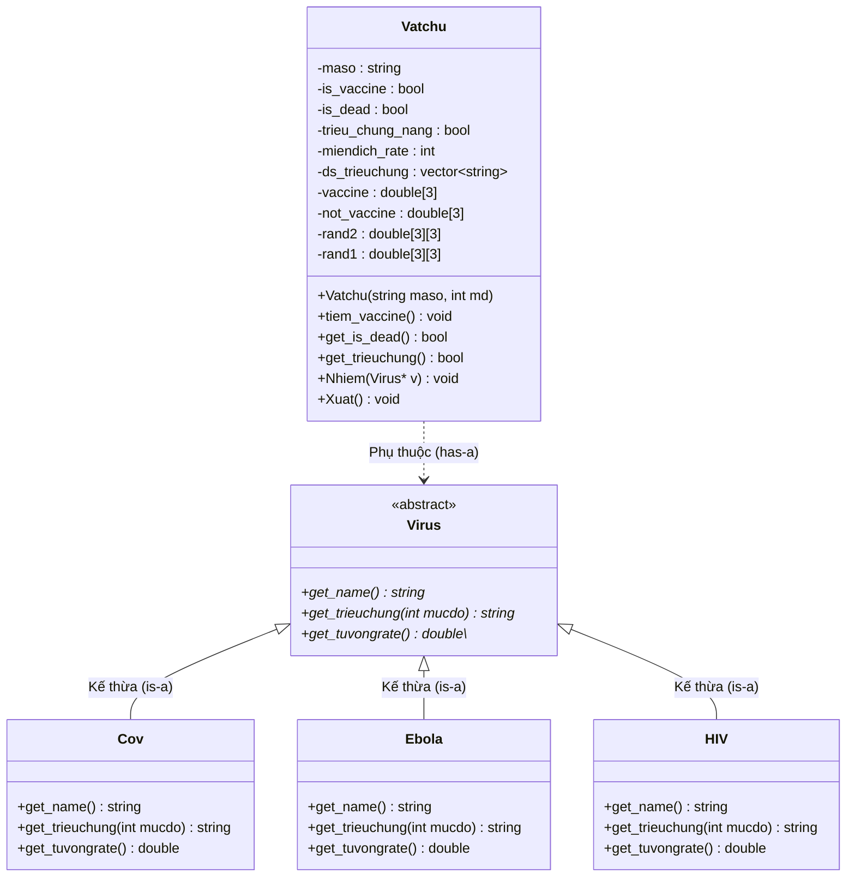

```mermaid
classDiagram
class Virus {
<<abstract>>
+get_name() string*
+get_trieuchung(int mucdo) string*
+get_tuvongrate() double\*
}

    class Cov {
        +get_name() string
        +get_trieuchung(int mucdo) string
        +get_tuvongrate() double
    }

    class Ebola {
        +get_name() string
        +get_trieuchung(int mucdo) string
        +get_tuvongrate() double
    }

    class HIV {
        +get_name() string
        +get_trieuchung(int mucdo) string
        +get_tuvongrate() double
    }

    class Vatchu {
        -maso : string
        -is_vaccine : bool
        -is_dead : bool
        -trieu_chung_nang : bool
        -miendich_rate : int
        -ds_trieuchung : vector~string~
        -vaccine : double[3]
        -not_vaccine : double[3]
        -rand2 : double[3][3]
        -rand1 : double[3][3]
        +Vatchu(string maso, int md)
        +tiem_vaccine() void
        +get_is_dead() bool
        +get_trieuchung() bool
        +Nhiem(Virus* v) void
        +Xuat() void
    }

    %% Mối quan hệ kế thừa (Inheritance)
    Virus <|-- Cov : Kế thừa (is-a)
    Virus <|-- Ebola : Kế thừa (is-a)
    Virus <|-- HIV : Kế thừa (is-a)

    %% Mối quan hệ phụ thuộc (Dependency)
    Vatchu ..> Virus : Phụ thuộc (has-a)

```
